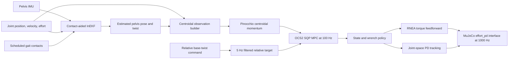

# Centroidal MPC and InEKF Tuning Handoff

## Purpose

This document records the current state of the G1 centroidal-dynamics MPC and contact-aided InEKF integration, the exact configuration that has been tested, the experiments that have already failed, and the next recommended tuning work.

The immediate objective is stable closed-loop locomotion when the MPC observation is built from the proprioceptive InEKF instead of MuJoCo ground truth.

The current result is stable for the tested flat-ground stance, backward walking, lateral walking, yaw, and mixed-command cases in simulation.

The current result is not yet evidence of real-hardware readiness because initialization, contact detection, IMU bias estimation, and sensor-noise validation remain incomplete.

## Repository State

| Item | Current value |
| --- | --- |
| Repository | `legged_robot_mpc_controller` |
| Branch | `feat/state_estimation` |
| Controller commit at handoff | `88e5e0a351af8af2e88d45725e7e8070da88e147` |
| Estimator repository | `../legged_state_estimator` |
| Estimator branch | `main` |
| Estimator commit at handoff | `fe22857362e1ad26f2aedba06c6a46a322e32355` |
| Default controller | `humanoid_centroidal_mpc_controller` |
| Default parameter file | `config/g1/ros2_controllers_legacy.yaml` |
| Default floating-base source | `state_estimator` |
| MPC frequency | 100 Hz |
| MRT/controller frequency | 1000 Hz |
| Solver | OCS2 SQP |

The launch defaults are defined in [`launch/g1.launch.py`](launch/g1.launch.py#L26) and [`launch/g1.launch.py`](launch/g1.launch.py#L45).

All quantitative results below came from the default `ros2_controllers_legacy.yaml` file.

Do not attribute these results to `ros2_controllers.yaml` without rerunning the tests because that file intentionally differs in analytical-gradient, rollout, foot-constraint, and OCP cost settings.

## Current Closed-Loop Data Flow



At every controller update, [`update_and_write_commands()`](src/humanoid_centroidal_mpc/humanoid_centroidal_mpc_controller.cpp#L425) first advances the estimator, builds the observation, evaluates the latest MPC policy, and writes the low-level joint command.

The MPC solver itself runs in a separate 100 Hz worker thread in [`solver_worker()`](src/humanoid_centroidal_mpc/humanoid_centroidal_mpc_controller.cpp#L987).

## InEKF Inputs and Outputs

### Inputs

The estimator receives the following values through ros2_control state interfaces at the 1000 Hz controller rate:

| Input | Representation | Source |
| --- | --- | --- |
| Gyroscope | Pelvis/IMU local frame | `pelvis_imu/angular_velocity.*` |
| Accelerometer | Pelvis/IMU local frame | `pelvis_imu/linear_acceleration.*` |
| Joint position | Controller joint order | Joint state interfaces |
| Joint velocity | Controller joint order | Joint state interfaces |
| Joint effort | Controller joint order | Joint state interfaces |
| Contact state | Left/right scheduled stance flags | MPC reference manager |

The input collection and scheduled-contact update are implemented in [`update_state_estimator()`](src/humanoid_centroidal_mpc/humanoid_centroidal_mpc_controller.cpp#L571).

Four kinematic contact frames are mapped to two scheduled feet:

```text
foot_l_heel_est -> left foot
foot_l_toe_est  -> left foot
foot_r_heel_est -> right foot
foot_r_toe_est  -> right foot
```

### Internal InEKF State

Conceptually, the contact-aided InEKF estimates

$$
\mathcal{X}_{\mathrm{InEKF}} = \left(R_{WI},\; v_{WI}^{W},\; p_{WI}^{W},\; b_g,\; b_a,\; p_{WC_1}^{W},\ldots,p_{WC_n}^{W}\right),
$$

where $I$ is the IMU frame and $C_i$ are active contact landmarks.

The controller wrapper converts the IMU estimate back to the pelvis frame using the fixed IMU-to-pelvis transform and a rigid-body lever-arm velocity correction in [`InekfFloatingBaseEstimator::updateImpl()`](src/humanoid_state_estimation/inekf_floating_base_estimator.cpp#L299).

The wrapper returns

$$
\hat{x}_{B} = \left(\hat{p}_{WB}^{W},\; \hat{R}_{WB},\; \hat{v}_{WB}^{W},\; \hat{\omega}_{WB}^{B}\right).
$$

The internal world-frame linear velocity is converted to body-frame twist only when publishing `/humanoid/state_estimate/odom`, following the ROS odometry child-frame convention in [`update_state_estimator()`](src/humanoid_centroidal_mpc/humanoid_centroidal_mpc_controller.cpp#L648).

### InEKF Process Model

For a world-centric state, the continuous-time inertial model is

$$
\begin{aligned}
\dot R_{WI} &= R_{WI}\left(\omega_m-b_g-n_g\right)^\wedge, \\
\dot v_{WI}^{W} &= g^W + R_{WI}\left(a_m-b_a-n_a\right), \\
\dot p_{WI}^{W} &= v_{WI}^{W}, \\
\dot b_g &= n_{bg}, \\
\dot b_a &= n_{ba}, \\
\dot d_i^W &= n_{c_i}, \qquad i\in\mathcal C,
\end{aligned}
$$

where $\omega_m$ and $a_m$ are IMU measurements, $b_g$ and $b_a$ are IMU biases, $d_i^W$ is the world position of active contact landmark $i$, and $\mathcal C$ is the active contact set.

The mean is propagated on $SO(3)$ with the exact $\Gamma_0$, $\Gamma_1$, and $\Gamma_2$ integration terms:

$$
\begin{aligned}
R_{k+1} &= R_k\Gamma_0(\phi_k), \\
v_{k+1} &= v_k + \left(R_k\Gamma_1(\phi_k)\bar a_k+g^W\right)\Delta t, \\
p_{k+1} &= p_k + v_k\Delta t +
\left(R_k\Gamma_2(\phi_k)\bar a_k+\tfrac12 g^W\right)\Delta t^2,
\end{aligned}
$$

with $\phi_k=(\omega_m-b_g)\Delta t$ and $\bar a_k=a_m-b_a$.

The covariance propagation is

$$
P_{k+1}^{-}=\Phi_kP_k^{+}\Phi_k^T+Q_{d,k},
\qquad
Q_{d,k}\approx(\Phi_kG_k)Q_c(\Phi_kG_k)^T\Delta t.
$$

The continuous covariance is block diagonal in gyroscope, accelerometer, active-contact, gyroscope-bias, and accelerometer-bias noise:

$$
Q_c=\operatorname{blkdiag}(Q_g,Q_a,Q_{c_1},\ldots,Q_{c_n},Q_{bg},Q_{ba}).
$$

The exact propagation and approximate noise discretization are implemented in [`InEKF::Propagate()`](../legged_state_estimator/src/inekf/inekf.cpp#L253) and [`InEKF::DiscreteNoiseMatrix()`](../legged_state_estimator/src/inekf/inekf.cpp#L221).

### Contact Observation Model

Forward kinematics supplies the measured contact position relative to the floating base,

$$
y_i(q_j)=p_{IC_i}^{I}(q_j),
$$

while an active contact landmark is assumed stationary in the world.

The world-centric innovation used by the code is

$$
r_i=R_{WI}y_i-\left(d_i^W-p_{WI}^{W}\right).
$$

For all active contacts, the residuals and Jacobians are stacked before one right-invariant correction:

$$
r=\begin{bmatrix}r_1\\ \vdots\\ r_n\end{bmatrix},
\qquad
S=HP^-H^T+N,
\qquad
K=P^-H^TS^{-1}.
$$

The corrected group state and Joseph-form covariance update are

$$
X^+=\exp\!\left((Kr)^\wedge\right)X^-,
\qquad
P^+=(I-KH)P^-(I-KH)^T+KNK^T.
$$

Contacts are added to the state on touchdown and removed on liftoff in [`InEKF::CorrectKinematics()`](../legged_state_estimator/src/inekf/inekf.cpp#L445).

The controller currently supplies scheduled contact flags, and [`LeggedStateEstimator::update()`](../legged_state_estimator/src/legged_state_estimator.cpp#L192) constructs each kinematic measurement covariance as

$$
N_i=\sigma_{p_c}^2 I_3,
$$

because external scheduled contacts bypass the optional force-confidence covariance.

`noise.contactPosition` is therefore a measurement standard deviation, not a variance.

The `NoiseParams` setters similarly square the configured process-noise values before placing them in $Q_c$.

The current correction is position-only; `noise.contactRotation` is configured but does not enter this contact-position correction path.

### Height Conditioning

The active height mode is `anchored` with a kinematic blend weight of `0.9`.

For each stance contact, the estimator stores a touchdown ground-height anchor and uses forward kinematics to infer a pelvis height consistent with that contact.

The output height is approximately

$$
\hat{z}_{B} = (1-w_z)\hat{z}_{B,\mathrm{InEKF}} + w_z\hat{z}_{B,\mathrm{kin}},
\qquad w_z = 0.9.
$$

This conditioning is implemented in [`InekfFloatingBaseEstimator::updateImpl()`](src/humanoid_state_estimation/inekf_floating_base_estimator.cpp#L351).

It reduced the previous several-centimetre height error to roughly 2-4 mm in the current simulation tests.

### Warm-Up and Handoff

The InEKF is initialized from the MuJoCo ground-truth pelvis position and orientation on its first update in [`update_state_estimator()`](src/humanoid_centroidal_mpc/humanoid_centroidal_mpc_controller.cpp#L609).

The controller continues using ground-truth floating-base feedback for 5 seconds, then atomically switches the complete pelvis pose and twist to the estimator in [`build_observation()`](src/humanoid_centroidal_mpc/humanoid_centroidal_mpc_controller.cpp#L830).

There is no hybrid estimator/ground-truth feedback after handoff.

This initialization is simulation-only and must be replaced before a real-hardware test.

## Centroidal MPC Model

The active setting is `centroidalModelType: 0`, which selects OCS2 full centroidal dynamics rather than the single-rigid-body approximation.

For 23 optimized joints and two 6D foot contacts, the state and input are

$$
x=
\begin{bmatrix}
\bar h\\ q
\end{bmatrix}
\in\mathbb R^{35},
\qquad
u=
\begin{bmatrix}
w_L\\ w_R\\ \dot q_j
\end{bmatrix}
\in\mathbb R^{35},
$$

with

$$
\bar h=\frac{h_G}{m}=
\begin{bmatrix}
h_{\mathrm{lin}}^W/m\\ h_{\mathrm{ang}}^W/m
\end{bmatrix},
\qquad
q=\begin{bmatrix}p_{WB}^{W}\\ \eta_{\mathrm{ZYX}}\\ q_j\end{bmatrix},
\qquad
w_i=\begin{bmatrix}f_i^W\\ \tau_i^W\end{bmatrix}.
$$

Both linear and angular centroidal momentum and both contact wrenches are represented in the world-aligned centroidal frame.

The normalized momentum dynamics are

$$
\dot{\bar h}_{\mathrm{lin}}
=g^W+\frac{1}{m}\sum_{i\in\{L,R\}}f_i^W,
$$

$$
\dot{\bar h}_{\mathrm{ang}}
=\frac{1}{m}\sum_{i\in\{L,R\}}
\left[\left(p_{WC_i}^{W}-p_{W\mathrm{CoM}}^{W}\right)\times f_i^W+\tau_i^W\right].
$$

The generalized-coordinate dynamics are not an independent double-integrator model.

They are reconstructed from the full centroidal momentum relation

$$
m\bar h=A_G(q)\nu
=A_b(q)\nu_b+A_j(q)\dot q_j,
$$

so that

$$
\nu_b=A_b(q)^{-1}\left(m\bar h-A_j(q)\dot q_j\right),
\qquad
\dot q=\mathcal T(q)\begin{bmatrix}\nu_b\\ \dot q_j\end{bmatrix}.
$$

Here $\mathcal T(q)$ includes the floating-base ZYX orientation-rate convention used by the OCS2 Pinocchio mapping.

This is why joint motion changes the base velocity implied by the same centroidal momentum and why a noisy observed base twist contaminates the momentum state used to initialize the rollout.

The contact-wrench momentum rate is implemented in [`getNormalizedCentroidalMomentumRate()`](../ocs2_ros2/robotics/ocs2_pinocchio/ocs2_centroidal_model/src/ModelHelperFunctions.cpp#L174), and the full-centroidal velocity reconstruction is implemented in [`CentroidalModelPinocchioMappingTpl::getPinocchioJointVelocity()`](../ocs2_ros2/robotics/ocs2_pinocchio/ocs2_centroidal_model/src/CentroidalModelPinocchioMapping.cpp#L80).

[`PinocchioCentroidalDynamicsAD::getValueCppAd()`](../ocs2_ros2/robotics/ocs2_pinocchio/ocs2_centroidal_model/src/PinocchioCentroidalDynamicsAD.cpp#L78) combines both equations into the OCS2 flow map and provides its CppAD linearization to SQP.

### Optimal Control Problem

The running and terminal objective have the form

$$
J=\Phi(x(T),x^\star(T))+
\int_{t_0}^{T}
\left[
\frac12\|x-x^\star\|_Q^2+
\frac12\|u-u^\star\|_R^2+
\ell_{\mathrm{foot}}+
\ell_{\mathrm{torso}}+
\ell_{\tau}+\ell_{\mathrm{soft}}
\right]dt.
$$

The OCP also contains mode-dependent stance/swing equalities and soft inequalities:

| Term | Active behavior |
| --- | --- |
| Swing-foot zero wrench | Sets the corresponding $w_i$ to zero in swing |
| Stance-foot velocity | Constrains stance-foot motion using the configured stabilization gains |
| Normal foot velocity | Enforces the mode-dependent normal-motion condition |
| Friction cone | Relaxed-barrier soft inequality |
| Contact moment rectangle | Relaxed-barrier center-of-pressure/contact-moment inequality |
| Joint limits | State soft constraint |
| Foot/knee collision | State soft constraint |
| Foot tracking | Tracks planned swing-foot pose and velocity |
| Torso tracking | Tracks selected torso-frame motion |
| Leg torque cost | Penalizes estimated external joint torque effort |

The terms are assembled in [`CentroidalMpcInterface::setupOptimalControlProblem()`](src/core/humanoid_centroidal_mpc/src/CentroidalMpcInterface.cpp#L132), and the YAML arrays are mapped into the cost matrices in [`centroidal_mpc_config_builder.cpp`](src/humanoid_centroidal_mpc/centroidal_mpc_config_builder.cpp#L138).

## MPC Observation Mapping

The InEKF state is not directly the centroidal MPC state.

The controller first constructs Pinocchio generalized coordinates and velocities:

$$
q =
\begin{bmatrix}
p_{WB}^{W} \\
\eta_{\mathrm{ZYX}}(R_{WB}) \\
q_j
\end{bmatrix},
\qquad
\nu =
\begin{bmatrix}
v_{WB}^{W} \\
\dot{\eta}_{\mathrm{ZYX}}(\omega_{WB}^{B}) \\
\dot{q}_j
\end{bmatrix}.
$$

The observation components and their actual sources are:

| MPC quantity | State-estimator source | Used directly? |
| --- | --- | --- |
| Base position $p_{WB}^W$ | InEKF position after IMU-to-pelvis transform and height conditioning | Yes, in $q$ |
| Base orientation $R_{WB}$ | InEKF rotation after IMU-to-pelvis transform | Converted to ZYX Euler angles in $q$ |
| Base linear velocity $v_{WB}^W$ | InEKF velocity plus rigid-body IMU/pelvis lever-arm correction | Filtered, then used in $A_G(q)\nu/m$ |
| Base angular velocity $\omega_{WB}^B$ | Bias-corrected local gyroscope, not an independent InEKF group-state component | Converted to ZYX rates, filtered, then used in momentum |
| Joint position $q_j$ | ros2_control joint state interfaces | Yes, in $q$ and Pinocchio kinematics |
| Joint velocity $\dot q_j$ | ros2_control joint state interfaces | Filtered, then used in momentum and $u_{\mathrm{obs}}$ |
| Contact landmarks $d_i^W$ | Internal augmented InEKF state | No direct MPC state entry; they correct base pose and velocity |
| IMU biases $b_g,b_a$ | Internal InEKF Euclidean state | Only indirectly through corrected IMU, but currently reset during correction |
| InEKF covariance $P$ | Internal estimator covariance | Not currently passed to MPC or used for gain/weight scheduling |

The key coupling is therefore

$$
\delta\bar h
\approx\frac{1}{m}
\left[A_G(q)\delta\nu+
\frac{\partial(A_G(q)\nu)}{\partial q}\delta q\right].
$$

Even when global $x$, $y$, and yaw are unweighted gauges, velocity, roll/pitch, height, and joint-state errors can alter the initial momentum and every predicted kinematic/contact quantity.

The complete generalized velocity is low-pass filtered at 30 Hz at the 1000 Hz controller rate:

$$
\nu_k^{f} = \alpha\nu_k + (1-\alpha)\nu_{k-1}^{f},
\qquad
\alpha = 1-\exp(-2\pi f_c\Delta t),
\qquad f_c=30\;\mathrm{Hz}.
$$

The centroidal state is then

$$
x_{\mathrm{MPC}} =
\begin{bmatrix}
\bar{h} \\
q
\end{bmatrix},
\qquad
\bar{h}=\frac{A_G(q)\nu^f}{m},
$$

where $A_G$ is Pinocchio's centroidal momentum matrix and $m$ is total robot mass.

This mapping is implemented in [`build_observation()`](src/humanoid_centroidal_mpc/humanoid_centroidal_mpc_controller.cpp#L794), with the momentum calculation at [`build_observation()`](src/humanoid_centroidal_mpc/humanoid_centroidal_mpc_controller.cpp#L921).

Consequently, a base twist error changes all centroidal momentum components through $A_G(q)\nu/m$ and can directly destabilize the OCP even if the pose estimate looks visually accurate.

### Observed MPC Input

The centroidal input has contact wrenches followed by joint velocities.

The currently observed input is

$$
u_{\mathrm{obs}} =
\begin{bmatrix}
0_{12} \\
\dot{q}_j^{f}
\end{bmatrix}.
$$

Contact wrenches are unknown and remain zero, while measured filtered joint velocities populate the input tail through [`setJointVelocities()`](src/humanoid_centroidal_mpc/humanoid_centroidal_mpc_controller.cpp#L928).

This replaced the earlier all-zero observed input and makes the state/input pair consistent with the joint-velocity contribution used to calculate centroidal momentum.

## Relative Base-Twist Target

The base-twist command is intentionally relative and short-horizon.

The normalized ROS command is bounded, scaled to physical units, and passed through one stateful 5 Hz low-pass filter in [`WalkingVelocityTarget`](src/core/humanoid_common_mpc/src/target/WalkingVelocityTarget.cpp#L45).

The filtered command is

$$
c = \begin{bmatrix}v_x^B & v_y^B & z_B^\star & \omega_z^B\end{bmatrix}^{T}.
$$

At each solve, the target generator re-anchors at the current estimated pose and integrates only the commanded pelvis-frame twist over the MPC horizon:

$$
p_{k+1}^{\star} = p_k^{\star} + R_z(\psi_k^{\star})v_{xy}^{B,\star}\Delta t,
\qquad
\psi_{k+1}^{\star}=\psi_k^{\star}+\omega_z^{\star}\Delta t.
$$

The implementation is [`commandedVelocityToTargetTrajectories()`](src/core/humanoid_centroidal_mpc/src/command/CentroidalMpcTargetTrajectoriesCalculator.cpp#L105).

Estimator velocity is not integrated into the target.

Global $x$, $y$, and yaw drift therefore move the local gauge but do not accumulate as a growing tracking error in the default legacy configuration, whose running base-pose weights for $x$, $y$, and yaw are zero.

Estimator twist noise still affects the current MPC state and centroidal momentum, so target relativity does not remove the need for a good velocity estimate.

The command filter was previously non-recursive and duplicated by a second alpha filter.

It is now stateful and time-correct in [`BreakFrequencyAlphaFilter`](include/humanoid_common_mpc/reference_manager/BreakFrequencyAlphaFilter.h#L38), and the duplicate filter stage has been removed.

## Low-Level Torque Execution

The MPC policy provides desired joint position, desired joint velocity, and contact wrenches.

The controller computes feedforward torque with Pinocchio RNEA using the observed generalized state, zero joint acceleration, and policy contact wrenches in [`compute_mpc_joint_action()`](src/humanoid_centroidal_mpc/humanoid_centroidal_mpc_controller.cpp#L1081).

The MuJoCo `effort_pd` interface applies

$$
\tau = \tau_{\mathrm{RNEA}} + K_p(q_j^{\star}-q_j)+K_d(\dot{q}_j^{\star}-\dot{q}_j)
$$

at the 1000 Hz controller/physics update.

Current MPC servo gains are $K_p=1200$ and $K_d=10$ for all optimized joints.

The six excluded wrist joints use fixed-posture gains $K_p=100$ and $K_d=1$.

## Active Tested Parameters

The active values are in [`config/g1/ros2_controllers_legacy.yaml`](config/g1/ros2_controllers_legacy.yaml#L377).

### Estimator and Feedback

The configured `noise.*` values are standard deviations; the estimator squares them when constructing covariance matrices.

| Parameter | Active value | Role and tuning interpretation |
| --- | ---: | --- |
| `control.observationVelocityFilterCutoffHz` | 30 Hz | Best tested balance between noise suppression and phase lag |
| `stateEstimator.warmupSeconds` | 5.0 s | Avoids switching to the zero-velocity transient |
| `noise.gyroscope` | 0.01 rad/s/$\sqrt{\mathrm{Hz}}$-like model value | Larger values reduce propagation confidence in angular rate |
| `noise.accelerometer` | 1.5 m/s$^2$/$\sqrt{\mathrm{Hz}}$-like model value | Larger values reduce propagation confidence in high-frequency pelvis acceleration |
| `noise.gyroscopeBias` | $10^{-5}$ | Gyro-bias random walk; currently ineffective because correction resets bias |
| `noise.accelerometerBias` | $10^{-4}$ | Accelerometer-bias random walk; currently ineffective because correction resets bias |
| `noise.contact` | 0.01 m/$\sqrt{\mathrm{Hz}}$-like model value | Contact-landmark process noise; larger values permit more contact motion/slip |
| `noise.contactPosition` | 0.002 m | Contact-FK measurement standard deviation; best tested correction strength |
| `noise.contactRotation` | 0.01 rad | Configured but unused by the current position-only contact correction |
| `height.source` | `anchored` | Supports flat ground and changing contact heights |
| `height.kinematicWeight` | 0.9 | Keeps pelvis height consistent with stance FK |
| `height.anchorUpdateThreshold` | 0.05 m | Avoids re-anchoring on ordinary flat-ground noise |
| `height.groundZ` | 0.0 m | Initial flat-ground contact height before anchors are established |
| `contact.source` | `scheduled` | Only contact source that remained stable in current tests |
| `contact.footIndices` | `[0,0,1,1]` | Maps heel/toe estimator contacts to left/right gait contacts |
| `contact.probabilityThreshold` | 0.5 | Threshold for the optional torque-based detector |
| `contact.forceCovarianceAlpha` | 10.0 | Scales optional force-confidence measurement covariance |
| `contact.beta0` | `[-20,-20,-20,-20]` | Optional logistic contact-detector intercepts |
| `contact.beta1` | `[0.7,0.7,0.7,0.7]` | Optional logistic force slopes |
| `contact.dynamicEstimation` | `false` | Torque contact detector is not active |
| Validation linear threshold | 0.1 m/s | Per-controller-cycle pass/fail threshold |
| Validation angular threshold | 0.2 rad/s | Per-controller-cycle pass/fail threshold |

The `lpf.*` settings mostly support optional dynamic contact estimation and derived signals.

With `contact.source: scheduled` and `dynamicEstimation: false`, they should not be treated as equivalent to the 30 Hz filter applied to the actual MPC generalized velocity.

The configured auxiliary cutoffs are gyro 80 Hz, gyro acceleration 50 Hz, linear acceleration 15 Hz, joint velocity 10 Hz, joint acceleration 5 Hz, and joint torque 10 Hz.

These primarily support derived estimator signals and optional dynamic contact detection; the InEKF propagation still receives the raw configured IMU samples.

### MPC State and Input Weights

The active legacy centroidal costs are in [`ros2_controllers_legacy.yaml`](config/g1/ros2_controllers_legacy.yaml#L558).

The diagonal quadratic cost is

$$
\ell_Q=\frac12(x-x^\star)^TQ(x-x^\star),
\qquad
\ell_R=\frac12(u-u^\star)^TR(u-u^\star).
$$

| Cost | Running | Terminal |
| --- | --- | --- |
| Normalized centroidal momentum | `[8, 8, 15, 15, 15, 4]` | `[25, 25, 25, 25, 25, 25]` |
| Base pose `[x,y,z,yaw,pitch,roll]` | `[0, 0, 15, 0, 5, 5]` | `[0, 0, 20, 0, 5, 5]` |

The zero $x$, $y$, and yaw pose weights are important for relative-twist locomotion and global-gauge drift tolerance.

The running and terminal joint-position weights are:

| Joint group | Running | Terminal |
| --- | --- | --- |
| Left leg | `[0.02, 0.06, 4, 0.02, 0.01, 0.01]` | `[0.02, 0.06, 8, 0.02, 0.01, 0.01]` |
| Right leg | `[0.02, 0.06, 4, 0.02, 0.01, 0.01]` | `[0.02, 0.06, 8, 0.02, 0.01, 0.01]` |
| Waist | `[2, 0.5, 0.5]` | `[2, 0.5, 0.5]` |
| Left arm | `[30, 30, 10, 20]` | `[50, 50, 15, 30]` |
| Right arm | `[30, 30, 10, 20]` | `[50, 50, 15, 30]` |

The arm entries are moved out of the generic $Q$ block and applied by the dedicated joint-tracking cost in [`centroidal_mpc_config_builder.cpp`](src/humanoid_centroidal_mpc/centroidal_mpc_config_builder.cpp#L149).

The input scaling is `rScaling: 0.001`, so the effective diagonal entries are the following arrays multiplied by $10^{-3}$:

| Input group | Unscaled diagonal weights |
| --- | --- |
| Left foot wrench `[fx,fy,fz,mx,my,mz]` | `[0.05, 0.05, 0.01, 0.05, 0.05, 0.2]` |
| Right foot wrench `[fx,fy,fz,mx,my,mz]` | `[0.05, 0.05, 0.01, 0.05, 0.05, 0.2]` |
| Left leg joint velocity | `[20, 20, 200, 20, 20, 20]` |
| Right leg joint velocity | `[20, 20, 200, 20, 20, 20]` |
| Waist joint velocity | `[2000, 800, 2000]` |
| Left arm joint velocity | `[200, 100, 100, 200]` |
| Right arm joint velocity | `[200, 100, 100, 200]` |

`qScaling` is 1.0, `terminalCostScaling` is 3.0, and `rScaling` is 0.001.

### Task-Space and Torque Weights

The foot and torso arrays use `[position xyz, orientation xyz, linear velocity xyz, angular velocity xyz]` ordering.

| Cost | Active weights |
| --- | --- |
| Foot task-space tracking | `[0,0,0, 1000,1000,0, 10,10,0, 1,1,0.005]` |
| Torso (`mid360_link`) tracking | `[0,0,0, 100,100,0, 0.1,0.1,0.005, 5,5,2]` |
| ICP | `0.0` in both planar axes |
| Leg torque scaling | `0.0001` |
| Left/right leg torque weights | `[2,2,1,8,0.2,0.2]` |

The foot position entries are zero because the swing planner and mode constraints already define much of the contact motion, while orientation, planar velocity, and angular velocity receive explicit regularization.

### Constraint and Solver Parameters

| Parameter group | Active values |
| --- | --- |
| Contact frame translation | `[0.035, 0, -0.035]` m |
| Contact rectangle | `[0.09, -0.09, 0.03, -0.03]` m |
| Friction cone | coefficient 0.4, barrier $\mu=0.2$, $\delta=5.0$ |
| Contact moment XY | barrier $\mu=0.6$, $\delta=0.03$ |
| Joint limits | barrier $\mu=1200$, $\delta=0.1$ |
| Foot/knee collision | radii 0.065/0.07 m, barrier $\mu=30000$, $\delta=0.05$ |
| SQP | $\Delta t=0.02$ s, one iteration, five threads |
| Horizon | 1.0 s |
| MPC/MRT | 100/1000 Hz |
| Integration | RK4 SQP transcription; ODE45 rollout at nominal 0.02 s |

The stance-foot stabilization gains are position-$z$ 5, orientation 20, linear velocity 1, and angular velocity 1.

The swing trajectory uses 0.08 m clearance, 0.05 m/s liftoff velocity, a -0.001 m touchdown offset, and a 0.4 swing-time scale.

### Other Parameters Worth Optimizing

Tune these in blocks and keep estimator, OCP, and low-level changes separated so a stability change remains attributable.

| Priority | Parameter block | Candidate optimization objective | Main risk |
| ---: | --- | --- | --- |
| 1 | InEKF $\sigma_a$, $\sigma_{p_c}$, contact process noise | Minimize same-cycle velocity and height error without handoff transients | Too much contact trust injects FK/impact error; too little permits inertial drift |
| 1 | Observation velocity cutoff | Minimize momentum-noise p95 subject to bounded phase lag | Low cutoff delays balance feedback |
| 1 | Handoff gate and warm-up | Switch only after covariance, innovation, and stationary checks pass | Time-only handoff can accept an unconverged estimate |
| 2 | Measured-contact confidence and slip rejection | Reject invalid stationary-foot assumptions | False contact loss removes critical corrections |
| 2 | Momentum $Q/Q_f$ by component | Balance disturbance rejection, tracking, and estimator sensitivity | Lowering weights can hide estimator defects rather than fix them |
| 2 | Base $z$, pitch, and roll weights | Improve height and attitude regulation | Excessive values can demand infeasible wrench changes |
| 2 | Foot/torso task weights | Reduce upper-body motion and swing-foot error | Competes with balance and contact feasibility |
| 3 | Wrench and joint-velocity $R$ | Smooth force redistribution and joint motion | Excessive regularization reduces agility |
| 3 | Friction/contact-moment barriers | Preserve feasible contact wrench margins | Large $\mu$ or poor $\delta$ conditioning can slow or distort SQP |
| 3 | MPC horizon, SQP step, and iteration count | Improve preview and convergence under timing budget | Increased latency can negate optimization quality |
| 3 | Low-level $K_p$, $K_d$, and policy offset | Match policy execution and reduce state-policy lag | High gains amplify contact and estimator noise |
| 4 | Gait timing, swing clearance, touchdown offset | Improve terrain clearance and impact behavior | Must be evaluated separately from flat-ground estimator tuning |
| 4 | Command-filter break frequency | Trade command smoothness against response time | Does not filter estimator noise |

For estimator tuning, log $P$, contact innovation, normalized innovation squared, $\bar h$, and the same quantities reconstructed from ground truth.

For MPC tuning, optimize against fall rate, attitude peaks, velocity tracking, contact-margin violation, torque saturation, SQP timing, and policy-to-hardware tracking error rather than cost value alone.

## Automatic Test Environment

### VM and Container

```bash
ssh parallels@10.211.55.17
docker exec -it ros_humble_v1 bash
cd ~/ocs2_ros2_ws
```

If a previous launch left the container dirty:

```bash
docker stop ros_humble_v1
docker start ros_humble_v1
docker exec -it ros_humble_v1 bash
```

### Build

```bash
NUM_JOBS=2 && \
  export CMAKE_BUILD_PARALLEL_LEVEL=${NUM_JOBS} && \
  export MAKEFLAGS=-j${NUM_JOBS} && \
  export NINJAFLAGS=-j${NUM_JOBS} && \
  colcon build --symlink-install \
    --packages-select legged_robot_mpc_controller \
    --executor sequential --parallel-workers ${NUM_JOBS} \
    --cmake-force-configure \
    --cmake-args -DBUILD_TESTING=OFF -DCMAKE_BUILD_TYPE=Release && \
  . install/setup.bash
```

The latest build completed successfully.

### Closed-Loop Test Harness

Use [`tests/state_estimator_closed_loop_test.sh`](tests/state_estimator_closed_loop_test.sh#L1).

The test launches MuJoCo headless with `baseCommandGui:=false`, waits in stance through estimator warm-up, applies a command, settles in stance, and reports estimator error, displacement, attitude limits, and a verdict.

There are stairs in front of the initial robot pose.

Use negative $v_x$, lateral motion, or yaw-only commands for flat-ground estimator tests unless terrain walking is the explicit subject of the test.

Example:

```bash
FLOATING_BASE_SOURCE=state_estimator \
VX=-0.15 VY=0.0 YAW_RATE=0.0 PELVIS_HEIGHT=0.7925 \
STANCE_SECONDS=8 WALK_SECONDS=12 SETTLE_SECONDS=3 \
ros2 run legged_robot_mpc_controller \
  state_estimator_closed_loop_test.sh /tmp/inekf_vx.log
```

`VX`, `VY`, and `YAW_RATE` are normalized commands.

For the centroidal controller they are scaled by approximately 2.4 m/s, 1.2 m/s, and 1.0 rad/s respectively.

## Measured Baseline Results

All tests below used `floatingBaseSource:=state_estimator`, the default legacy YAML, 100 Hz MPC, 1000 Hz MRT, and no GUI or RViz.

| Test | Result | Motion | GT attitude limits | InEKF velocity result |
| --- | --- | --- | --- | --- |
| $v_x=-0.15$ | Success | $(-2.136,-0.097)$ m | roll 11.47 deg, pitch 7.67 deg | same-cycle mean 0.0264, p95 0.0533, max 0.0683 m/s |
| $v_y=-0.12$ | Success | $(0.038,-0.174)$ m | roll 7.20 deg, pitch 2.76 deg | same-cycle mean 0.0170, p95 0.0434, max 0.0492 m/s |
| $v_y=+0.20$ | Success | $(-0.007,+0.164)$ m | roll 6.87 deg, pitch 2.98 deg | topic-aligned mean 0.0215, max 0.1604 m/s |
| $\omega_z=+0.15$ | Success | yaw change 1.778 rad | roll 5.80 deg, pitch 2.87 deg | same-cycle mean 0.0178, p95 0.0369, max 0.0472 m/s |
| Height $0.75$ m, stance | Stable but height not tracked | final $z\approx0.791$ m | roll 0.20 deg, pitch 3.71 deg | same-cycle mean 0.0125, max 0.0317 m/s |
| Mixed $(-0.12,-0.08,-0.10,0.77)$ | Success | $(-1.162,+0.690)$ m, yaw -1.341 rad | roll 9.25 deg, pitch 6.56 deg | same-cycle mean 0.0209, p95 0.0486, max 0.0821 m/s |

The mixed test produced zero controller-cycle validation failures.

Its maximum angular-velocity error was 0.0004 rad/s, mean height error was 0.0026 m, and maximum height error was 0.0044 m.

The very small simulated angular error should not be interpreted as real-IMU performance because the MuJoCo IMU currently behaves almost noiselessly.

## Rejected Parameter Experiments

These experiments were applied temporarily, tested, and reverted.

Do not repeat them without a new hypothesis or additional instrumentation.

| Experiment | Result | Decision |
| --- | --- | --- |
| Centroidal observation cutoff 30 -> 12 Hz | $v_x$ max roll increased from 11.47 to 13.39 deg; p95 velocity error increased to 0.055; less progress | Keep 30 Hz |
| `contactPosition` 0.002 -> 0.001 | Maximum pitch increased to 12.99 deg | Keep 0.002 |
| `contactPosition` 0.002 -> 0.004 | Robot fell; max velocity error exceeded 1.1 m/s | Keep 0.002 |
| Contact source `scheduled` -> `torque` | Robot fell during stance near estimator handoff | Keep scheduled contacts |
| Horizontal momentum running weights 8 -> 6 and terminal 25 -> 18 | Some attitude reduction, but less progress and more lateral/yaw drift | Keep 8/25 |
| Base-height running/terminal weights 15/20 -> 30/40 | A 0.75 m command still ended near 0.789 m | Revert; height issue is not ordinary cost scaling |

The WB controller's 12 Hz observation filter was not part of these centroidal tests and must not be changed based solely on the centroidal result.

## Known Issues and Real-Hardware Gaps

### 1. InEKF Bias Correction Is Currently Disabled by Core Code

[`InEKF::CorrectRightInvariant()`](../legged_state_estimator/src/inekf/inekf.cpp#L315) explicitly resets the six bias states to zero and removes their cross-covariance on every correction:

```cpp
Theta = Eigen::Matrix<double,6,1>::Zero();
```

As a result, the validation logs show $b_g=b_a=0$ and zero bias rates throughout the simulation.

The configured gyro and accelerometer bias noise values therefore do not provide real bias convergence under the current correction path.

This must be fixed and validated with injected IMU bias before using the estimator on hardware.

### 2. Initialization Uses MuJoCo Ground Truth

The first estimator pose is seeded from the simulator's pelvis position and orientation.

For hardware, replace this with a practical initialization strategy:

1. Estimate roll and pitch from stationary gravity.
2. Choose an arbitrary initial yaw gauge or use an external heading source.
3. Set world $x=y=0$ or another arbitrary local origin.
4. Infer pelvis height from stance-foot FK and known/contact-estimated ground height.
5. Initialize velocity to zero only after a verified stationary period.

### 3. Scheduled Contacts Are Intended Contacts, Not Measured Contacts

The estimator trusts the MPC gait schedule.

This is deterministic in simulation but can be wrong during early touchdown, late liftoff, slip, impact, or failed footholds.

Real hardware needs a measured contact detector with hysteresis and confidence, or a robust fusion between scheduled and measured contact state.

The rejected torque detector should not simply be re-enabled; it failed in stance with its current calibration.

### 4. Height Command Is Not Being Followed

Changing `desired_pelvis_height` from 0.7925 m to 0.75 or 0.77 m leaves the actual pelvis around 0.789-0.791 m.

The command reaches the relative target generator, and doubling the base-height cost did not fix it.

Instrument the generated target trajectory and the reference-manager target after all synchronized modules to determine whether height is overwritten or merely rejected by another OCP tradeoff.

Treat this as a target/reference bug, not an InEKF tuning issue.

### 5. Global Drift Is Tolerated but Not Eliminated

The relative-twist target is re-anchored every horizon, and the tested legacy configuration has zero $x$, $y$, and yaw pose weights.

This makes global translation and yaw drift mostly a gauge change rather than a growing tracking error.

Roll, pitch, height, and twist remain balance-critical and cannot drift freely.

The non-legacy YAML has different base-pose weights and must be independently checked for gauge sensitivity.

### 6. Simulation Does Not Exercise Real Sensor Failure Modes

Current tests do not cover realistic timestamp jitter, asynchronous IMU/joint sampling, encoder quantization, IMU bias, scale error, vibration, packet loss, contact slip, or structural compliance.

The published 100 Hz odometry is for monitoring; the controller uses the estimator result directly at the 1000 Hz update rate.

### 7. Terrain Walking With InEKF Is Not Yet Validated

Flat-ground closed-loop estimator control passes.

Terrain and staircase walking use planned support heights and touchdown anchors, but the full terrain case has not been regression-tested with `floatingBaseSource:=state_estimator` after the latest estimator changes.

Test it only after the flat-ground estimator has passed longer and noise-injected runs.

## Recommended Next Work

### Phase 1: Improve Observability and Diagnostics

1. Log estimator covariance diagonals for orientation, velocity, position, and biases.
2. Log contact innovation, innovation covariance, normalized innovation squared, and contact state transitions.
3. Log raw IMU, bias-corrected IMU, and the exact propagation timestep.
4. Log the six normalized momentum components from estimator feedback and from MuJoCo GT using the same $A_G(q)$ calculation.
5. Separate metrics into warm-up, handoff, stance, motion, and settle phases.
6. Save test data as rosbag or CSV instead of relying only on rate-limited console logs.

### Phase 2: Fix and Validate IMU Bias Estimation

1. Remove the unconditional bias reset in `CorrectRightInvariant()` while preserving a positive-definite covariance.
2. Add unit tests for constant gyro and accelerometer bias convergence.
3. Inject known MuJoCo IMU biases and white noise.
4. Verify that estimated bias converges without destabilizing contact corrections.
5. Retune `gyroscopeBias` and `accelerometerBias` process noise only after bias estimation is functional.

### Phase 3: Replace Ground-Truth Initialization

1. Add a stationary detector.
2. Initialize roll/pitch from averaged acceleration.
3. Initialize height from stance FK.
4. Use an arbitrary local $x,y,yaw$ gauge.
5. Delay handoff until velocity, contact residual, and covariance checks all pass instead of using time alone.

### Phase 4: Contact Robustness

1. Add measured contact state from foot force/torque, pressure, or calibrated joint-torque residuals.
2. Fuse measured contact confidence with the planned mode schedule.
3. Reject contacts with excessive innovation or detected slip.
4. Test early/late contact and one-foot slip cases.

### Phase 5: Closed-Loop Parameter Search

Keep one-factor-at-a-time experiments and compare against the baseline table.

Recommended first sweeps after diagnostics are available:

| Parameter | Candidate values | Primary metric |
| --- | --- | --- |
| Observation velocity cutoff | 20, 25, 30, 40 Hz | attitude peak versus velocity-error p95 |
| Accelerometer noise | 1.0, 1.5, 2.0 | vertical velocity and momentum error |
| Contact-position noise | 0.0015, 0.0020, 0.0025 | handoff transient and stance drift |
| Warm-up/handoff gate | covariance/residual based | transient at estimator takeover |

Do not lower momentum weights merely to hide estimator error.

The estimator should first provide a physically consistent state; OCP weights should then express control priorities.

### Phase 6: Longer and Harder Regression Tests

1. Run each flat-ground command for 30-60 seconds.
2. Repeat each test several times and report median and worst case.
3. Test combined commands in both yaw directions.
4. Test stopping from motion and rapid command reversal.
5. Test small external pushes.
6. Test terrain walking with estimator feedback.
7. Test sensor noise and bias injection.

## Acceptance Criteria for the Next Tuning Iteration

A candidate parameter set should not be accepted solely because the robot does not fall.

It should satisfy all of the following relative to the current baseline:

| Metric | Initial target |
| --- | ---: |
| Same-cycle linear velocity error p95 | $<0.05$ m/s |
| Same-cycle linear velocity error max | $<0.10$ m/s |
| Angular velocity error max in simulation | $<0.01$ rad/s |
| Height error max on flat ground | $<0.01$ m |
| Estimator validation failures | 0 |
| Stance handoff fall | Never |
| Walking fall in 30 s flat test | Never |
| Peak roll/pitch | No worse than the command-matched baseline |
| Directional progress and yaw response | No worse than 90% of baseline |

Any change that improves estimator error but causes materially worse motion tracking, attitude excursion, or solver timing should be rejected.

## Useful Runtime Commands

Launch manually:

```bash
ros2 launch legged_robot_mpc_controller g1.launch.py \
  mpcControllerName:=humanoid_centroidal_mpc_controller \
  mpcFreq:=100 \
  mrtFreq:=1000 \
  floatingBaseSource:=state_estimator \
  mujoco_headless:=true \
  baseCommandGui:=false \
  rviz:=false
```

Monitor estimator and GT odometry:

```bash
ros2 topic echo /humanoid/state_estimate/odom
ros2 topic echo /mujoco/ground_truth/odom
```

Extract controller-cycle validation:

```bash
grep 'INEKF_VELOCITY_VALIDATION' /tmp/inekf_test.log
grep 'INEKF_VELOCITY_VALIDATION.*FAIL' /tmp/inekf_test.log
```

The important log convention is:

```text
v_est_W, v_gt_W       world-frame pelvis linear velocity
omega_est_B, omega_gt_B  pelvis-frame angular velocity
e_v, e_omega          same-controller-cycle errors
b_g, b_a              estimated IMU biases
```

## Immediate Recommendation

Keep the current tested controller parameters unchanged while adding covariance, innovation, momentum, and IMU diagnostics.

The highest-priority algorithmic fix is functional IMU bias estimation in `legged_state_estimator`, followed by ground-truth-free initialization and measured contact confidence.

Do not continue broad controller-gain tuning until those estimator issues can be observed quantitatively.
