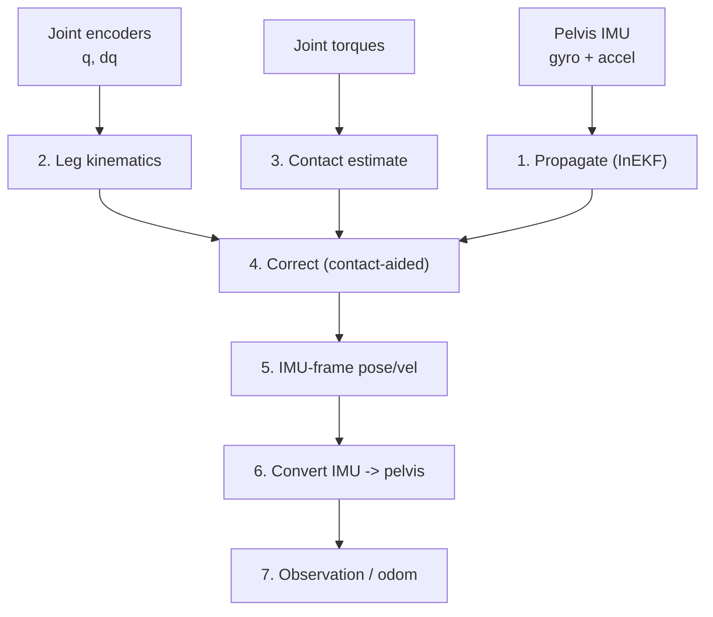

# Humanoid Floating-Base State Estimation (InEKF)

This document describes the proprioceptive floating-base state estimator used by the G1 centroidal MPC controller. It fuses the pelvis IMU with leg kinematics and contact information through a **contact-aided Invariant Extended Kalman Filter (InEKF)** to estimate the base pose and velocity, removing the controller's dependence on the MuJoCo ground-truth (GT) body frame.

The filter itself is the library [`legged_state_estimator`](https://github.com/mayataka/legged_state_estimator) (Hartley et al., *Contact-Aided Invariant EKF for Legged Robot State Estimation*, RSS 2018). The controller-side integration — sensor plumbing, joint remapping, IMU↔pelvis frame handling, bootstrapping and publishing — lives in [`humanoid_state_estimation/`](../src/humanoid_state_estimation/).

## What is observable, and why the rest does not matter

A proprioceptive estimator (IMU + encoders + contacts, no exteroception) observes a strict subset of the base state:

- **Observable — and what the controller needs:** roll/pitch (the accelerometer pins the gravity direction absolutely), base **height** (the stance foot is a fixed height reference through the leg kinematics), and base **linear velocity** in the body frame.
- **Unobservable — and it does not matter here:** absolute world $x,y$ position and yaw $\psi$. These lie in the filter's unobservable subspace and drift without bound.

The drift is harmless because the walking command is a **body-frame twist** and the centroidal MPC tracks base velocity, height, and orientation — never absolute world pose. Concretely, the momentum/base cost consumes the observation built in [`build_observation()`](../src/humanoid_centroidal_mpc/humanoid_centroidal_mpc_controller.cpp#L650-L722), whose base linear velocity is world-frame but whose *tracking target* is generated from the body-frame command; the absolute $x,y,\psi$ of the base never enter a cost. Tuning therefore optimizes roll/pitch, height, and body velocity and ignores $x,y,\psi$ drift.

## Runtime Pipeline (High Level)

<table>
<tr>
<td width="38%" valign="top">

</td>
<td width="62%" valign="top">

Each control tick, [`update_state_estimator()`](../src/humanoid_centroidal_mpc/humanoid_centroidal_mpc_controller.cpp#L558-L648):

1. Propagates the InEKF state with the raw pelvis gyro + accelerometer.
2. Updates the leg forward kinematics from the joint encoders.
3. Estimates per-foot contact from the joint torques (logistic regression).
4. Corrects the filter with the "stance contact is world-fixed" measurement.
5. Reads back the estimated **IMU-frame** pose and velocity.
6. Converts the IMU-frame estimate to the **pelvis** (floating-base) frame.
7. Writes the result into the MPC observation (when selected) and publishes it as odometry for evaluation against GT.

</td>
</tr>
</table>

The estimator is built in [`on_configure()`](../src/humanoid_centroidal_mpc/humanoid_centroidal_mpc_controller.cpp#L210-L246) when `stateEstimator.enabled` or `floatingBase.source == "state_estimator"`, and is a member of the controller: [`state_estimator_`](../include/legged_robot_mpc_controller/humanoid_centroidal_mpc/humanoid_centroidal_mpc_controller.hpp#L124).

## Filter Model

### Propagation

The InEKF state is the pose and velocity of the **IMU frame** together with the IMU biases,
$$
X=\big(\mathbf R,\ \mathbf p,\ \mathbf v\big)\in SE_2(3),\qquad
\mathbf b=\big(\mathbf b_g,\ \mathbf b_a\big),
$$
where $\mathbf R,\mathbf p,\mathbf v$ are the orientation, position and velocity of the IMU frame in the world. Given the bias-corrected gyro $\tilde{\boldsymbol\omega}=\boldsymbol\omega-\mathbf b_g$ and accelerometer $\tilde{\mathbf a}=\mathbf a-\mathbf b_a$, the continuous dynamics are
$$
\dot{\mathbf R}=\mathbf R\,(\tilde{\boldsymbol\omega})_\times,\qquad
\dot{\mathbf v}=\mathbf R\,\tilde{\mathbf a}+\mathbf g,\qquad
\dot{\mathbf p}=\mathbf v,
$$
with $\mathbf g=(0,0,-9.81)^{\mathsf T}$. The "invariant" property is that the estimation-error dynamics are (to first order) independent of the state, giving strong convergence. This step consumes the raw pelvis IMU measurements passed to [`estimator_->update()`](../src/humanoid_state_estimation/inekf_floating_base_estimator.cpp#L188).

### Contact-aided correction

While foot $i$ is in stance, the InEKF assumes its contact point is **fixed in the world**. The forward-kinematic contact position relative to the base, $\mathbf f_i(\mathbf q)$, provides a measurement whose residual constrains base position, velocity, and (together with gravity) the full pose. Crucially the filter does **not** assume flat ground: a foot re-anchors at whatever height it lands, so stairs and uneven terrain are handled natively without any terrain model — the terrain model remains a *planner-only* concern.

Contact state per foot is estimated from the joint torques by logistic regression inside the library, so no external contact schedule is required (though the gait schedule could be injected as a more deterministic alternative).

The InEKF requires exactly **four point contacts**, so each flat foot contributes a **heel and a toe** point (as in the MIT Humanoid whole-body work). These are added to the URDF at the sole, offset from the ankle-roll link, with names distinct from the MPC's own contact frames to avoid a Pinocchio frame-name collision: [`foot_l_heel_est` … `foot_r_toe_est`](../description/g1/urdf/g1_29dof.urdf#L627-L654).

## IMU ↔ Pelvis Frame Conversion

The single most important integration detail: **the InEKF estimates the IMU frame, but the MPC and GT use the pelvis** (the URDF floating-base root). On the G1 the IMU sits at $\mathbf t_{PI}=(0.04525,\,0,\,-0.08339)\,\text{m}$ below the pelvis, so a naive comparison shows an $\approx 8.3\,\text{cm}$ height offset. The wrapper removes this with the fixed transform $X_{PI}=(\mathbf R_{PI},\mathbf t_{PI})$ of the IMU frame in the pelvis frame, computed once from the model at construction: [constructor FK](../src/humanoid_state_estimation/inekf_floating_base_estimator.cpp#L96-L107).

At initialization, the incoming **pelvis** pose is converted to the **IMU** frame before seeding the filter,
$$
\mathbf R_I=\mathbf R_P\,\mathbf R_{PI},\qquad
\mathbf p_I=\mathbf p_P+\mathbf R_P\,\mathbf t_{PI},
$$
in [`initialize()`](../src/humanoid_state_estimation/inekf_floating_base_estimator.cpp#L150-L170). On output, the estimated IMU pose is converted back to the pelvis, with a rigid-body lever-arm correction for the linear velocity,
$$
\mathbf R_P=\mathbf R_I\,\mathbf R_{PI}^{\mathsf T},\qquad
\mathbf p_P=\mathbf p_I-\mathbf R_P\,\mathbf t_{PI},
$$
$$
\boldsymbol\omega_{P}^{\text{world}}=\mathbf R_I\,\boldsymbol\omega_I^{\text{local}},\qquad
\mathbf v_P^{\text{world}}=\mathbf v_I^{\text{world}}+\boldsymbol\omega_P^{\text{world}}\times(\mathbf p_P-\mathbf p_I),
$$
in [`update()`](../src/humanoid_state_estimation/inekf_floating_base_estimator.cpp#L192-L209). (For the G1 $\mathbf R_{PI}=\mathbf I$, but the transform is computed generally.)

The four contact landmarks are seeded at their **true world heights** from FK at the initial pose, so the filter is consistent with the actual foot geometry and with per-foot start heights on stairs: [`contactGroundHeights()`](../src/humanoid_state_estimation/inekf_floating_base_estimator.cpp#L129-L148).

## Joint Ordering

The controller provides joint values in its own `robot.jointNames` order (23 actuated joints), while the estimator's URDF model orders 29 joints by the Pinocchio tree. The wrapper builds a name→index map once and remaps every joint vector (position, velocity, torque), zero-filling URDF joints the controller does not actuate (e.g. wrists): [constructor map](../src/humanoid_state_estimation/inekf_floating_base_estimator.cpp#L72-L85) and [`remapToEstimatorOrder()`](../src/humanoid_state_estimation/inekf_floating_base_estimator.cpp#L117-L127).

## Sensor Plumbing (Simulation)

The estimator inputs come from `ros2_control` state interfaces exposed by `mujoco_ros2_control`:

- **Pelvis IMU** — a `<sensor name="pelvis_imu">` in [`g1.ros2_control_macro.xacro`](../description/g1/urdf/g1.ros2_control_macro.xacro#L115-L129) maps the MuJoCo `imu-pelvis-*` sensors to `orientation.*`, `angular_velocity.*`, and `linear_acceleration.*`. The MuJoCo model already has the gyro/accelerometer on the `imu_in_pelvis` site; a [`framequat`](../description/g1/mujoco/g1_29dof.xml#L285) was added because the IMU mapping requires a quaternion sensor. The IMU site pose matches the URDF `imu_in_pelvis` frame exactly.
- **Joint torque** — the joint macro already exposes an `effort` state interface, read for the torque-based contact estimator.

These are claimed in [`state_interface_configuration()`](../src/humanoid_centroidal_mpc/humanoid_centroidal_mpc_controller.cpp#L363-L402) whenever the estimator is active. The same wiring applies on hardware: real IMU, encoders, and joint-torque sensing replace the MuJoCo sources with no controller change.

## Bootstrapping and Selection

The filter is seeded once, on the first tick, from the MuJoCo GT body pose (on hardware this becomes a known start pose): [bootstrap](../src/humanoid_centroidal_mpc/humanoid_centroidal_mpc_controller.cpp#L596-L616). It runs every tick and publishes its odometry to `stateEstimator.odomTopic` for evaluation against GT.

Whether the estimate **drives control** is a single switch:

- `floatingBase.source: state_interfaces` — GT body drives the MPC; the InEKF (if `enabled`) runs only for comparison.
- `floatingBase.source: state_estimator` — the InEKF estimate replaces the GT body in the observation: [`use_estimate` branch](../src/humanoid_centroidal_mpc/humanoid_centroidal_mpc_controller.cpp#L686-L719).

## Configuration and Tuning

All parameters live under `stateEstimator` in the controller config (`config/g1/ros2_controllers.yaml`). The most important tuning finding on the G1:

> The pelvis accelerometer swings **±5 m/s²** while merely standing (stiff PD + contact vibration). The library default `accelerometer_noise = 0.1` makes the filter over-trust it, which pulls the estimated height down by ~4 cm. Raising `noise.accelerometer` to `1.5` and hard low-passing the accelerometer (`lpf.linAccelCutoff` `250 → 30 Hz`), while trusting the contact height-anchor more (`noise.contact`, `noise.contactPosition`), removes the droop **and** cuts body-velocity error ~3×.

## Verification (MuJoCo, GT drives control, InEKF in parallel)

With the tuned configuration, the InEKF estimate tracks GT on exactly the states that matter for locomotion:

| state | standing | walking (vx = 0.25 m/s) |
|---|---|---|
| roll error | 0.09–0.16° | 0.07–0.18° |
| pitch error | 0.13–0.14° | 0.02–0.04° |
| **height error** | 17–28 mm | 17–28 mm |
| **body-frame velocity error** | ~0.03 m/s | ~0.03 m/s |
| yaw drift / xy drift (unobservable, unused) | ~0° / ~10 mm | ~0° / ~17 mm |

Roll/pitch stay well under a quarter degree and body velocity within ~3 cm/s consistently; the height sits 1.4–2.8 cm low (run-to-run, from contact-estimation noise).

### Status: open-loop verified; closed-loop stable but not yet walking

- **Open-loop (`floatingBaseSource:=state_interfaces`, the default):** GT drives control and the InEKF runs alongside. The numbers above are reproducible. ✅
- **Closed-loop (`floatingBaseSource:=state_estimator`):** the estimate drives the MPC. The robot **no longer falls or diverges** (see the warm-up section below), and the estimate stays accurate *while driving* — roll 0.03°, pitch 0.08°, height error 9.5 mm, body velocity error 0.014 m/s over 704 samples. But the robot **crouches (z ≈ 0.65 versus the commanded 0.79) and does not walk forward**, with the gait selector flapping `stance ↔ slow_walk`. ⚠️

The remaining problem is therefore **not estimator accuracy** — the filter tracks ground truth well while in the loop, and the MPC solver is healthy (~57 % utilization at 96 Hz, no errors). It is a controller/gait interaction: the base velocity and momentum reconstructed from the estimate differ enough from the ground-truth-driven case to keep the gait scheduler oscillating and the base sagging.

Next steps to chase it:

1. Feed the MPC's **scheduled gait contacts** (`SwitchedModelReferenceManager::getContactFlags`) into the filter instead of torque-based contact detection (the MIT Humanoid approach: "contact states … assumed to match the pre-specified gait"). This removes contact-detection noise from the velocity/momentum estimate.
2. Add hysteresis / a longer dwell time to the gait selector so it cannot flap on noisy measured velocity.
3. Re-check the observation velocity low-pass (`control.observationVelocityFilterCutoffHz`) for the estimator path — it was tuned for the ground-truth signal.

### The warm-up window (why the estimate must not drive control immediately)

The original closed-loop failure was a **filter initialization transient**, not tuning and not the height bias. The InEKF is seeded with zero velocity and unknown IMU biases, so its first ~2 s carry roughly **±0.15 m/s of phantom base velocity**. Because the centroidal state is normalized momentum $h = A(q)\,v/m$, that velocity error enters the *dominant* state directly; the MPC fights a base it believes is sliding, and the robot fell at t ≈ 2 s while standing, before any walking command — with the height estimate still accurate to 3–14 mm at the moment of the fall.

`stateEstimator.warmupSeconds` (default 3.0 s) keeps the MPC on the state-interface base until the filter converges, then hands over ([warm-up gate](../src/humanoid_centroidal_mpc/humanoid_centroidal_mpc_controller.cpp#L686-L700)). Measured at hand-off, the phantom velocity has fallen to ~0.01–0.03 m/s and the robot no longer destabilizes. On hardware this corresponds to holding the robot at a known pose until the filter has converged.

## Files

| Concern | Location |
|---|---|
| Estimate struct | [`humanoid_state_estimation/floating_base_estimate.hpp`](../include/legged_robot_mpc_controller/humanoid_state_estimation/floating_base_estimate.hpp) |
| InEKF wrapper | [`humanoid_state_estimation/inekf_floating_base_estimator.{hpp,cpp}`](../src/humanoid_state_estimation/inekf_floating_base_estimator.cpp) |
| Controller integration | [`humanoid_centroidal_mpc_controller.cpp`](../src/humanoid_centroidal_mpc/humanoid_centroidal_mpc_controller.cpp) |
| Parameters | [`humanoid_centroidal_mpc_controller_parameter.yaml`](../src/humanoid_centroidal_mpc/humanoid_centroidal_mpc_controller_parameter.yaml) |
| IMU / contact frames | [`g1_29dof.urdf`](../description/g1/urdf/g1_29dof.urdf), [`g1.ros2_control_macro.xacro`](../description/g1/urdf/g1.ros2_control_macro.xacro), [`g1_29dof.xml`](../description/g1/mujoco/g1_29dof.xml) |
