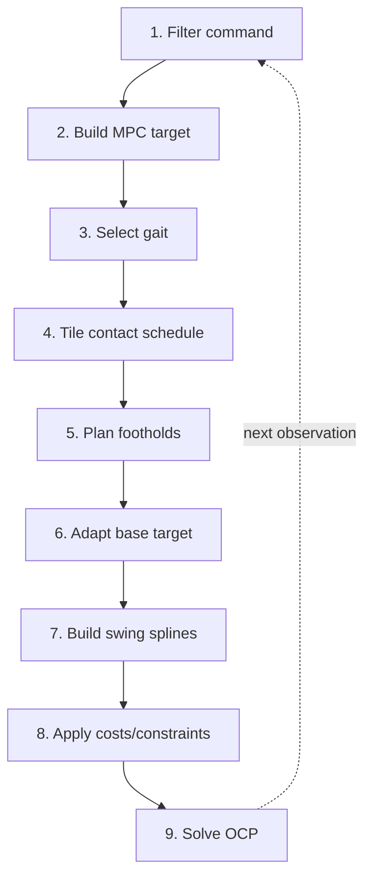
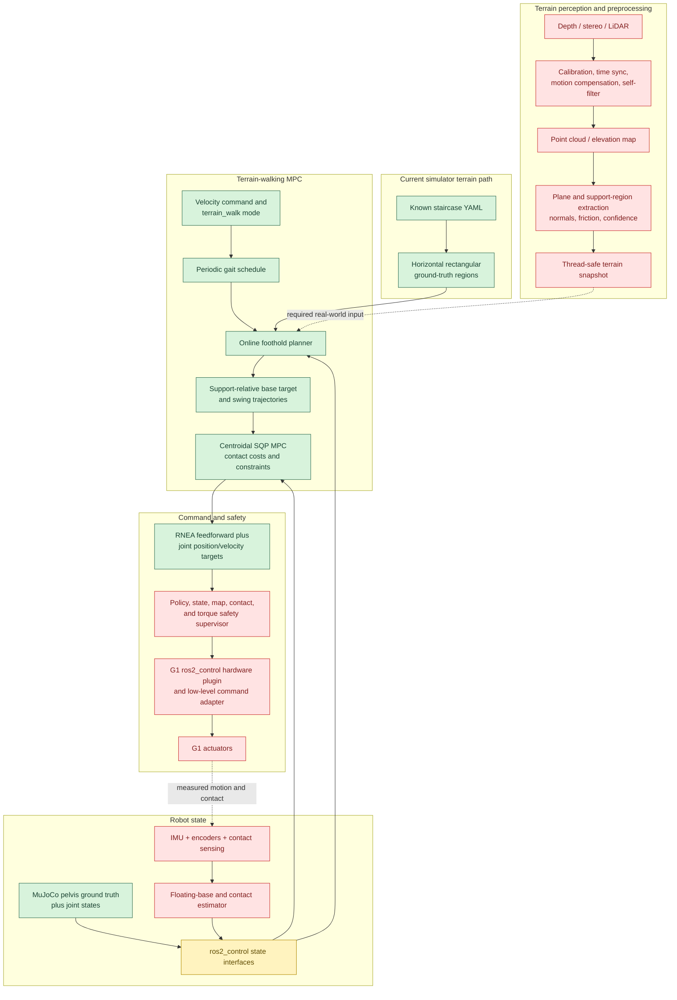

# Terrain-Aware Walking

This document describes the online `terrain_walk` pipeline used by the G1 centroidal MPC controller. It explains how a velocity command becomes an MPC target trajectory, how the periodic contact sequence is generated, how footholds are replanned over the known terrain, and how those references enter the optimal control problem.

The important distinction is:

- **The gait sequence is periodic:** it specifies which foot is in contact and when each lift-off (swing) or touchdown (stance) occurs.
- **The foothold sequence is online:** touchdown positions are recomputed from the latest MPC observation before each solve, except for a foothold that has been committed for an active swing.

Therefore, `terrain_walk` is not the fixed foothold sequence used by `stair_climb`.

## Runtime Pipeline (High Level)

<table>
<tr>
<td width="36%" valign="top">



</td>
<td width="64%" valign="top">

At each MPC update:

1. The latest normalized walking command is bounded, scaled to physical units, and low-pass filtered.
2. The filtered command generates a base/momentum target trajectory over the MPC horizon.
3. The motion manager selects the `terrain_walk` gait while the command is moving, or `stance` when it is stopped.
4. The gait template is tiled in time to form the horizon's contact mode schedule.
5. The terrain foothold planner uses the current base state, current foot positions, target trajectory, terrain model, and contact schedule to plan touchdown positions.
6. Near the stairs, the base reference is bounded relative to the planned support polygon and its height is adapted to the support height.
7. Planned lift-off and touchdown heights generate the swing-foot vertical splines.
8. The mode schedule activates the corresponding stance or swing constraints, while the planned swing position enters the foot tracking cost.
9. OCS2 solves the resulting switched optimal control problem. The complete process repeats with the next observation.

</td>
</tr>
</table>

The target mode string is converted to `TargetMode::TerrainWalk` in the [motion-manager adapter](../src/common/ros2_procedural_mpc_motion_manager.cpp#L54-L72). The solver-thread pipeline is selected in [`ProceduralMpcMotionManager::preSolverRun()`](../src/core/humanoid_common_mpc/src/reference_manager/ProceduralMpcMotionManager.cpp#L132-L179).

## Walking Command

The incoming command is

$$
\mathbf c =
\begin{bmatrix}
c_x & c_y & h_b & c_\psi
\end{bmatrix}^{\mathsf T},
$$

where $c_x,c_y,c_\psi\in[-1,1]$ are normalized forward, lateral, and yaw-rate commands, and $h_b$ is the desired pelvis height. The motion-manager adapter enforces these bounds before the command reaches the solver thread: [`boundedCommandFromMessage()`](../src/common/ros2_procedural_mpc_motion_manager.cpp#L18-L27).

The physical command is

$$
\bar{\mathbf c} =
\begin{bmatrix}
v_{x,\max}c_x \\
v_{y,\max}c_y \\
h_b \\
\dot{\psi}_{\max}c_\psi
\end{bmatrix}.
$$

The scaling and solver-thread low-pass filtering are implemented in [`WalkingVelocityTarget::scaleCommand()`](../src/core/humanoid_common_mpc/src/target/WalkingVelocityTarget.cpp#L50-L81) and [`evaluate()`](../src/core/humanoid_common_mpc/src/target/WalkingVelocityTarget.cpp#L50-L81). The filter produces

$$
\mathbf c_f[k]
=
\mathcal F\!\left(\bar{\mathbf c}[k],\mathbf c_f[k-1],\ldots\right),
$$

where $\mathcal F$ is the configured command filter. Scaling and filtering are performed exactly once per solver update.

### Base target trajectory

For centroidal MPC, the conditioned command defines the pelvis-frame planar twist

$$
\boldsymbol\xi_b^{\mathrm{cmd}} =
\begin{bmatrix}
v_x^{\mathrm{ref}} &
v_y^{\mathrm{ref}} &
\dot{\psi}^{\mathrm{ref}}
\end{bmatrix}^{\mathsf T}.
$$

At every MPC update the target is re-anchored at the latest estimated pose $\hat{\mathbf T}_{WB}(t_0)$ and propagated only over the finite horizon with the $SE(2)$ exponential map,

$$
\mathbf T_{WB}^{\mathrm{ref}}(t_0+\tau)
=
\hat{\mathbf T}_{WB}(t_0)
\operatorname{Exp}_{SE(2)}\!\left(\tau\boldsymbol\xi_b^{\mathrm{cmd}}\right),
\qquad 0\leq\tau\leq T_{\mathrm{MPC}}.
$$

The measured base velocity is not blended into this reference, so velocity-estimation noise remains feedback to the MPC initial state instead of moving the target itself. At each knot, the commanded horizontal velocity is rotated by that knot's target yaw to form the world-aligned normalized linear-momentum target, while the yaw-rate target retains the centroidal model's existing normalization. The knot times are

$$
t_0=t_{\mathrm{init}},\qquad
t_1=t_{\mathrm{init}}+0.7T_{\mathrm{MPC}},\qquad
t_2=t_{\mathrm{init}}+T_{\mathrm{MPC}}.
$$

For `base_twist`, `terrain_walk`, and `stair_climb`, the base tracking cost ignores the unobservable global $x$, $y$, and yaw pose errors, but retains pelvis height, roll, pitch, and body-frame motion tracking. Explicit `base_pose` commands select full pose tracking. The command-only integration is implemented in [`integrateBodyTwistTargetBasePose()`](../src/core/humanoid_common_mpc/src/command/TargetTrajectoriesCalculatorBase.cpp#L132-L160) and [`commandedVelocityToTargetTrajectories()`](../src/core/humanoid_centroidal_mpc/src/command/CentroidalMpcTargetTrajectoriesCalculator.cpp#L104-L141), while the mode-dependent invariant residual is implemented in [`BaseMotionTrackingCost.cpp`](../src/core/humanoid_common_mpc/src/cost/BaseMotionTrackingCost.cpp#L24-L119).

## Gait Sequence

### Contact modes

For two feet, define the contact flags

$$
\boldsymbol{\sigma}(t)
=
\begin{bmatrix}
\sigma_L(t) & \sigma_R(t)
\end{bmatrix}^{\mathsf T},
\qquad
\sigma_i =
\begin{cases}
1, & \text{foot $i$ is in contact},\\
0, & \text{foot $i$ is in swing}.
\end{cases}
$$

The available mode mappings are:

| Mode | $\sigma_L$ | $\sigma_R$ | Meaning |
| --- | ---: | ---: | --- |
| `FLY` | 0 | 0 | both feet in swing |
| `RF` | 0 | 1 | right support, left swing |
| `LF` | 1 | 0 | left support, right swing |
| `STANCE` | 1 | 1 | double support |

These mappings are defined by [`ModeNumber`](../include/humanoid_common_mpc/gait/MotionPhaseDefinition.h#L45-L74) and [`modeNumber2StanceLeg()`](../include/humanoid_common_mpc/gait/MotionPhaseDefinition.h#L45-L74).

### Terrain-walk template

The configured template is

$$
\mathcal G_{\mathrm{terrain}}
=
\left(
\begin{bmatrix}
\mathrm{LF} & \mathrm{STANCE} & \mathrm{RF} & \mathrm{STANCE}
\end{bmatrix},
\begin{bmatrix}
0 & 0.6 & 0.7 & 1.3 & 1.4
\end{bmatrix}
\right).
$$

It gives:

- $0.6\,\mathrm{s}$ right-foot swing with left-foot support;
- $0.1\,\mathrm{s}$ double support;
- $0.6\,\mathrm{s}$ left-foot swing with right-foot support;
- $0.1\,\mathrm{s}$ double support.

The gait period is

$$
T_g = 1.4\ \mathrm{s}.
$$

The source is the `terrain_walk` entry in  [`gait.yaml`](../config/g1/gait.yaml#L66-L68). Mode names are converted to mode numbers when loading the template in [`modeScheduleFromStrings()`](../src/core/humanoid_common_mpc/src/gait/ModeSequenceTemplate.cpp#L86-L99).

### Selecting and tiling the gait

Let the filtered command be $\mathbf c_f=[v_x,v_y,h_b,\dot\psi]^{\mathsf T}$. The motion manager uses

$$
\mathrm{moving}
=
\Big\{ |v_x|>0.03 \Big\}
\lor \Big\{ |v_y|>0.03 \Big\}
\lor \Big\{ |\dot\psi|>0.05 \Big\}.
$$

It selects `terrain_walk` while moving and `stance` otherwise. 

This bypasses the normal speed-dependent gait finite-state machine so the stair gait retains its long swing and double-support intervals: [`ProceduralMpcMotionManager.cpp`](../src/core/humanoid_common_mpc/src/reference_manager/ProceduralMpcMotionManager.cpp#L169-L203).

For template switching times $\tau_j$, the event times of cycle $k$ are

$$
t_{k,j}=t_s+kT_g+\tau_j.
$$

Equivalently, the schedule is extended recursively by

$$
t_{n+1}=t_n+\left(\tau_{j+1}-\tau_j\right).
$$

When changing gaits, an optional intermediate `STANCE` phase is inserted before the new template. The existing future schedule is truncated, then the selected template is tiled beyond the MPC horizon. This is implemented by [`insertModeSequenceTemplate()`](../src/core/humanoid_common_mpc/src/gait/GaitSchedule.cpp#L51-L78), [`getModeSchedule()`](../src/core/humanoid_common_mpc/src/gait/GaitSchedule.cpp#L83-L107), and [`tileModeSequenceTemplate()`](../src/core/humanoid_common_mpc/src/gait/GaitSchedule.cpp#L113-L143).

The reference manager requests a schedule over an interval wider than the current horizon:

$$
\left[t_{\mathrm{init}}-T_h,\ t_{\mathrm{final}}+T_h\right],
\qquad
T_h=t_{\mathrm{final}}-t_{\mathrm{init}},
$$

so swing construction has the neighboring phases needed at both boundaries: [`SwitchedModelReferenceManager.cpp`](../src/core/humanoid_common_mpc/src/reference_manager/SwitchedModelReferenceManager.cpp#L143-L171).

## Ground-Truth Terrain Model

The current terrain model is a flat ground plane plus horizontal rectangular stair treads. For tread $i$, the configured riser height and depth are $\Delta z_i$ and $d_i$. Its top height and local center are

$$
z_i=z_g+\sum_{j=0}^{i}\Delta z_j,
$$

$$
\mathbf p_{i,\mathrm{local}} =
\begin{bmatrix}
x_{\mathrm{start}}+\sum_{j=0}^{i-1}d_j+\frac{d_i}{2}\\
0
\end{bmatrix}.
$$

The center is rotated and translated into the world frame using the staircase yaw and base position. The construction is implemented in [`buildTerrainModelFromStairs()`](../src/core/humanoid_common_mpc/src/reference_manager/TerrainFootholdPlanner.cpp#L50-L83).

For a world point $\mathbf p_{xy}$, the height query returns the highest region containing the point:

$$
H(\mathbf p_{xy})
=
\max\left(
z_g,\,
\left\{z_i\mid
\left|p_{i,x}^{\mathrm{local}}\right|\leq \ell_{i,x},
\left|p_{i,y}^{\mathrm{local}}\right|\leq \ell_{i,y}
\right\}
\right).
$$

See [`GroundTruthTerrainModel::heightAt()`](../src/core/humanoid_common_mpc/src/reference_manager/TerrainFootholdPlanner.cpp#L37-L46). The staircase geometry and planner parameters are configured in [`terrain_walking.yaml`](../config/g1/terrain/terrain_walking/terrain_walking.yaml#L19-L47) and parsed in [`config_builder_utils.cpp`](../src/common/config_builder_utils.cpp#L89-L125).

The planner is currently attached by the centroidal controller during configuration: [`humanoid_centroidal_mpc_controller.cpp`](../src/humanoid_centroidal_mpc/humanoid_centroidal_mpc_controller.cpp#L175-L187).

## Online Foothold Planning

The planner runs before every solve. Its inputs are:

$$
\left(
\mathcal M,\,
\mathbf x(t_0),\,
\mathbf p_L(t_0),\,
\mathbf p_R(t_0),\,
\mathbf x^{\mathrm{ref}}(\cdot),\,
\mathcal G(\cdot)
\right),
$$

where $\mathcal M$ is the terrain model and $\mathcal G$ is the mode schedule. The API and solver-thread ownership are documented in [`TerrainFootholdPlanner.h`](../include/humanoid_common_mpc/reference_manager/TerrainFootholdPlanner.h#L83-L105). Current foot positions are obtained by Pinocchio forward kinematics in [`computeFeetPositions()`](../src/core/humanoid_common_mpc/src/reference_manager/SwitchedModelReferenceManager.cpp#L246-L258).

### Capture-point correction

For the first upcoming step, the nominal foothold receives a velocity-feedback offset:

$$
\Delta\mathbf p_{\mathrm{cp}}
=
k_{\mathrm{cp}}
\left(
\mathbf v_{b,xy}
-\mathbf v_{b,xy}^{\mathrm{ref}}
\right).
$$

Its magnitude is limited to $p_{\mathrm{cp,max}}$:

$$
\Delta\mathbf p_{\mathrm{cp}}
\leftarrow
\begin{cases}
\Delta\mathbf p_{\mathrm{cp}},
& \|\Delta\mathbf p_{\mathrm{cp}}\|\leq p_{\mathrm{cp,max}},\\[2mm]
p_{\mathrm{cp,max}}
\dfrac{\Delta\mathbf p_{\mathrm{cp}}}
{\|\Delta\mathbf p_{\mathrm{cp}}\|},
& \text{otherwise}.
\end{cases}
$$

See [`TerrainFootholdPlanner::update()`](../src/core/humanoid_common_mpc/src/reference_manager/TerrainFootholdPlanner.cpp#L173-L190).

### Nominal foothold

For foot $f$, the desired base displacement from now to touchdown is applied relative to the measured base:

$$
\mathbf p_{b,xy}^{\mathrm{td}}
=
\mathbf p_{b,xy}
+
\left(
\mathbf p_{b,xy}^{\mathrm{ref}}(t_{\mathrm{td}})
-\mathbf p_{b,xy}^{\mathrm{ref}}(t_0)
\right).
$$

With heading vectors

$$
\mathbf e_f =
\begin{bmatrix}\cos\psi\\ \sin\psi\end{bmatrix},
\qquad
\mathbf e_l =
\begin{bmatrix}-\sin\psi\\ \cos\psi\end{bmatrix},
$$

the nominal foothold is

$$
\mathbf p_{f,xy}^{\mathrm{nom}}
=
\mathbf p_{b,xy}^{\mathrm{td}}
+d_f\mathbf e_f
+s_f d_{\mathrm{hip}}\mathbf e_l
+\mathbb 1_{\mathrm{first}}\Delta\mathbf p_{\mathrm{cp}},
$$

where $d_f=0.06\,\mathrm{m}$, $s_L=+1$, and $s_R=-1$. Near the staircase, the lateral coordinate is anchored to its centerline to prevent base drift from collapsing the stance width. The implementation is in [`TerrainFootholdPlanner.cpp`](../src/core/humanoid_common_mpc/src/reference_manager/TerrainFootholdPlanner.cpp#L235-L266).

### Terrain projection

Each terrain candidate $r$ is rejected if its height change is unreachable:

$$
\left|z_r-z_{\mathrm{prev}}\right|>\Delta z_{\max}.
$$

Otherwise, the planner clamps the nominal point into the candidate tread after shrinking it by the configured foot margins. It selects

$$
r^\star
=
\underset{r\in\mathcal R_{\mathrm{reachable}}}{\arg\min}
\left(
\left\|
\Pi_r\!\left(\mathbf p_{f,xy}^{\mathrm{nom}}\right)
-\mathbf p_{f,xy}^{\mathrm{nom}}
\right\|_2
-b_r
\right),
$$

where $\Pi_r$ is projection into the usable rectangle and $b_r$ is a positive bonus for a higher tread. Ground candidates are excluded inside the staircase footprint because the ground does not physically exist below a tread. See [`projectFoothold()`](../src/core/humanoid_common_mpc/src/reference_manager/TerrainFootholdPlanner.cpp#L87-L151).

### Reachable step-up and approach step

If a selected higher tread is within the one-swing horizontal reach $d_{\max}=0.22\,\mathrm{m}$, the touchdown is moved to its nearest safe edge:

$$
\left\|
\mathbf p_{\mathrm{edge},xy}
-\mathbf p_{\mathrm{prev},xy}
\right\|_2
\leq d_{\max}.
$$

If it is not reachable, the foot remains on the current terrain and takes a bounded approach step:

$$
\mathbf p_{\mathrm{approach},xy}
=
\mathbf p_{\mathrm{prev},xy}
+d_{\max}
\frac{
\mathbf p_{\mathrm{tread},xy}-\mathbf p_{\mathrm{prev},xy}
}{
\left\|
\mathbf p_{\mathrm{tread},xy}-\mathbf p_{\mathrm{prev},xy}
\right\|_2
}.
$$

The approach point is pushed out of an overhanging higher tread so the foot cannot be commanded into a riser. The logic is implemented in [`TerrainFootholdPlanner.cpp`](../src/core/humanoid_common_mpc/src/reference_manager/TerrainFootholdPlanner.cpp#L268-L325).

### Replanning and commitment

Future footholds are feedback-replanned each solver update. A touchdown is latched when

$$
t_{\mathrm{lo}}
\leq
t_0+T_{\mathrm{commit}},
$$

and the same lift-off/touchdown event pair remains active. Once latched, its lift-off and touchdown positions stay fixed throughout the swing. This avoids reference jumps caused by re-anchoring to an in-flight measured foot. The commitment is released after touchdown. See [`TerrainFootholdPlanner.cpp`](../src/core/humanoid_common_mpc/src/reference_manager/TerrainFootholdPlanner.cpp#L192-L233).

## References Given to the MPC

### Support-relative base reference

Away from the stairs, the original velocity-command target is retained. Near the stairs, anticipated left and right foot positions define the support midpoint

$$
\mathbf p_s(t)
=
\frac{1}{2}
\left(
\mathbf p_L^{\mathrm{plan}}(t)
+\mathbf p_R^{\mathrm{plan}}(t)
\right).
$$

Let the original base target have forward and lateral lead

$$
\ell_f =
\left(
\mathbf p_{b,xy}^{\mathrm{ref}}-\mathbf p_{s,xy}
\right)^{\mathsf T}\mathbf e_f,
\qquad
\ell_l =
\left(
\mathbf p_{b,xy}^{\mathrm{ref}}-\mathbf p_{s,xy}
\right)^{\mathsf T}\mathbf e_l.
$$

The reference is bounded around the support:

$$
\mathbf p_{b,xy}^{\mathrm{ref}}
\leftarrow
\mathbf p_{s,xy}
+\operatorname{clip}(\ell_f,-L,L)\mathbf e_f
+\operatorname{clip}(\ell_l,-L,L)\mathbf e_l.
$$

The pelvis height becomes

$$
z_b^{\mathrm{ref}}
\leftarrow
z_s
+\min\!\left(h_b,H_{b,\max}\right).
$$

Forward and lateral target velocities are reduced as the base reaches its maximum forward lead:

$$
\gamma_v
=
\operatorname{clip}
\left(
\frac{2\left(L-\max(\ell_f,0)\right)}{L},
0,1
\right),
\qquad
\mathbf v_{b,xy}^{\mathrm{ref}}
\leftarrow
\gamma_v\mathbf v_{b,xy}^{\mathrm{ref}}.
$$

This prevents the target base from running too far ahead of reachable footholds. The complete adaptation is in [`SwitchedModelReferenceManager.cpp`](../src/core/humanoid_common_mpc/src/reference_manager/SwitchedModelReferenceManager.cpp#L173-L228).

### Swing-foot horizontal reference

During a planned swing from $t_{\mathrm{lo}}$ to $t_{\mathrm{td}}$, define

$$
\alpha(t)
=
\operatorname{clip}
\left(
\frac{t-t_{\mathrm{lo}}}
{\rho\left(t_{\mathrm{td}}-t_{\mathrm{lo}}\right)},
0,1
\right),
$$

where $\rho$ is `swing_reference_arrival_fraction`. The task-space reference is

$$
\mathbf p_f^{\mathrm{ref}}(t)
=
\mathbf p_f^{\mathrm{lo}}
+\alpha(t)
\left(
\mathbf p_f^{\mathrm{td}}-\mathbf p_f^{\mathrm{lo}}
\right).
$$

Thus, the reference reaches the touchdown early and holds there for the remaining swing. On open flat ground this extra foothold reference is disabled and ordinary velocity-command walking is preserved: [`getSwingFootReference()`](../src/core/humanoid_common_mpc/src/reference_manager/TerrainFootholdPlanner.cpp#L385-L403).

The foot tracking residual includes position, orientation-to-plane, linear velocity, and angular velocity errors:

$$
\mathbf e_f =
\begin{bmatrix}
\mathbf p_f-\mathbf p_f^{\mathrm{ref}}\\
d_R(\mathbf R_f,\mathbf n)\\
\gamma_{\mathrm{impact}}
\left(\mathbf v_f-\mathbf v_f^{\mathrm{ref}}\right)\\
\boldsymbol\omega_f-\boldsymbol\omega_f^{\mathrm{ref}}
\end{bmatrix},
\qquad
\ell_f=\frac{1}{2}\left\|\mathbf W_f^{1/2}\mathbf e_f\right\|_2^2.
$$

The planned foothold and dynamic XY weight are injected by [`CentroidalMpcEndEffectorFootCost::getParameters()`](../src/core/humanoid_centroidal_mpc/src/cost/CentroidalMpcEndEffectorFootCost.cpp#L127-L160), while the residual is evaluated in [`costVectorFunction()`](../src/core/humanoid_centroidal_mpc/src/cost/CentroidalMpcEndEffectorFootCost.cpp#L92-L121).

To avoid pinning a foot to an unreachable target, its foothold weight is scaled by the planned horizontal reach $r$:

$$
w_f(r)
=
w_{\mathrm{terrain}}
\operatorname{clip}
\left(
\frac{r_{\mathrm{far}}-r}
{r_{\mathrm{far}}-r_{\mathrm{commit}}},
s_{\min},1
\right),
$$

with $r_{\mathrm{commit}}=0.20\,\mathrm{m}$, $r_{\mathrm{far}}=0.34\,\mathrm{m}$, and $s_{\min}=0.05$. See [`getSwingFootholdReference()`](../src/core/humanoid_common_mpc/src/reference_manager/SwitchedModelReferenceManager.cpp#L265-L295).

### Swing-foot vertical reference

The planned support heights are sampled at every phase boundary and passed to the swing planner: [`TerrainFootholdPlanner::getHeightSequences()`](../src/core/humanoid_common_mpc/src/reference_manager/TerrainFootholdPlanner.cpp#L407-L428) and [`SwitchedModelReferenceManager.cpp`](../src/core/humanoid_common_mpc/src/reference_manager/SwitchedModelReferenceManager.cpp#L230-L233).

For a complete swing, the vertical trajectory is a two-part cubic spline with nodes

$$
\left(t_{\mathrm{lo}},z_{\mathrm{lo}},\dot z_{\mathrm{lo}}\right),
\qquad
\left(t_{\mathrm{td}},z_{\mathrm{td}},\dot z_{\mathrm{td}}\right),
$$

and apex

$$
z_{\mathrm{apex}}
=
\max(z_{\mathrm{lo}},z_{\mathrm{td}})
+s_T h_{\mathrm{swing}},
$$

where $s_T$ is the swing-duration scaling. Using the higher contact surface ensures clearance while stepping up. The spline construction is in [`SwingTrajectoryPlanner::update()`](../src/core/humanoid_common_mpc/src/swing_foot_planner/SwingTrajectoryPlanner.cpp#L99-L141).

## How the MPC Follows the Gait

The mode schedule changes the OCP itself; it is not only a reference used for visualization.

For foot $i$:

### Stance phase: $\sigma_i(t)=1$

The stance-foot twist constraint is active:

$$
\mathbf v_i(\mathbf x,\mathbf u)=\mathbf 0,
$$

with optional position/orientation stabilization. Its activation follows the contact flag in [`ZeroVelocityConstraintCppAd::isActive()`](../src/core/humanoid_centroidal_mpc/src/constraint/ZeroVelocityConstraintCppAd.cpp#L61-L77). The friction-cone soft constraint is also active only in contact: [`FrictionForceConeConstraint::isActive()`](../src/core/humanoid_common_mpc/src/constraint/FrictionForceConeConstraint.cpp#L70-L85).

### Swing phase: $\sigma_i(t)=0$

The contact wrench is constrained to zero:

$$
\mathbf w_i(\mathbf u)=\mathbf 0.
$$

See [`ZeroWrenchConstraint`](../src/core/humanoid_common_mpc/src/constraint/ZeroWrenchConstraint.cpp#L59-L83). The normal swing velocity/height tracking constraint is active only out of contact: [`NormalVelocityConstraintCppAd::isActive()`](../src/core/humanoid_centroidal_mpc/src/constraint/NormalVelocityConstraintCppAd.cpp#L61-L87).

Its stabilized vertical relation has the form

$$
\dot z_i-\dot z_i^{\mathrm{ref}}
+k_z\left(z_i-z_i^{\mathrm{ref}}\right)=0.
$$

The time-varying $z_i^{\mathrm{ref}}$ and $\dot z_i^{\mathrm{ref}}$ are read from the swing splines by [`HumanoidPreComputation::request()`](../src/core/humanoid_common_mpc/src/HumanoidPreComputation.cpp#L96-L123).

All foot constraints and the task-space foot cost are registered in the centroidal OCP in [`CentroidalMpcInterface.cpp`](../src/core/humanoid_centroidal_mpc/src/CentroidalMpcInterface.cpp#L185-L212).

The solver consequently optimizes the centroidal state, joint configuration, contact wrenches, and motion inputs against:

$$
\min_{\mathbf x(\cdot),\mathbf u(\cdot)}
\quad
\Phi\!\left(\mathbf x(t_f)\right)
+
\int_{t_0}^{t_f}
\ell\!\left(
t,\mathbf x(t),\mathbf u(t);
\mathbf x^{\mathrm{ref}},
\mathbf p_f^{\mathrm{ref}},
\boldsymbol\sigma
\right)\,dt,
$$

subject to the centroidal dynamics and the mode-dependent contact constraints above.

## Online Terrain Walk vs. Fixed Stair Climb

| Property | `terrain_walk` | `stair_climb` |
| --- | --- | --- |
| Input | persistent base velocity command | mode trigger |
| Contact timing | periodic `terrain_walk` gait | prebuilt climbing plan |
| Touchdown XY | replanned from feedback each MPC update | generated once in a fixed sequence |
| Terrain Z | queried from the terrain model | prescribed by the fixed plan |
| Active swing target | latched shortly before lift-off | fixed by the plan |
| Base reference | velocity target adapted to planned support | plan-specific staircase reference |
| Stop behavior | zero command switches to `stance` | plan completion |

## Configuration and Test

The default launch file provides the gait library and terrain-walking files via [`g1.launch.py`](../launch/g1.launch.py#L51-L66) and its launch arguments [`g1.launch.py`](../launch/g1.launch.py#L91-L100). The current default controller file is `ros2_controllers_legacy.yaml`, where the centroidal controller receives these paths under `ocs2.gait`: [`ros2_controllers_legacy.yaml`](../config/g1/ros2_controllers_legacy.yaml#L564-L571).

Start the centroidal controller, select terrain mode, and publish a forward walking command:

```bash
ros2 launch legged_robot_mpc_controller g1.launch.py \
  mpcControllerName:=humanoid_centroidal_mpc_controller

ros2 topic pub --once /humanoid/target_mode \
  std_msgs/msg/String "{data: terrain_walk}"

ros2 topic pub -r 25 /humanoid/walking_velocity_command \
  ocs2_msgs/msg/WalkingVelocityCommand \
  "{linear_velocity_x: 0.08, linear_velocity_y: 0.0,
    desired_pelvis_height: 0.72, angular_velocity_z: 0.0}"
```

The autonomous regression launches the same controller, commands forward velocity, stops after the pelvis climbs the staircase, and checks that the robot remains upright: [`tests/terrain_walk_test.sh`](../tests/terrain_walk_test.sh#L1-L22) and [`tests/terrain_walk_test.sh`](../tests/terrain_walk_test.sh#L70-L165).

Run it from a sourced workspace with:

```bash
ros2 run legged_robot_mpc_controller terrain_walk_test.sh \
  /tmp/terrain_walk.log 90
```

## Main Source Map

| Responsibility | Source |
| --- | --- |
| ROS commands and target-mode parsing | [`ros2_procedural_mpc_motion_manager.cpp`](../src/common/ros2_procedural_mpc_motion_manager.cpp#L18-L27) |
| Velocity target conditioning | [`WalkingVelocityTarget.cpp`](../src/core/humanoid_common_mpc/src/target/WalkingVelocityTarget.cpp#L40-L81) |
| Centroidal target trajectory | [`CentroidalMpcTargetTrajectoriesCalculator.cpp`](../src/core/humanoid_centroidal_mpc/src/command/CentroidalMpcTargetTrajectoriesCalculator.cpp#L104-L174) |
| Terrain-walk gait selection | [`ProceduralMpcMotionManager.cpp`](../src/core/humanoid_common_mpc/src/reference_manager/ProceduralMpcMotionManager.cpp#L132-L203) |
| Gait schedule tiling | [`GaitSchedule.cpp`](../src/core/humanoid_common_mpc/src/gait/GaitSchedule.cpp#L51-L143) |
| Terrain model and foothold planning | [`TerrainFootholdPlanner.cpp`](../src/core/humanoid_common_mpc/src/reference_manager/TerrainFootholdPlanner.cpp#L37-L347) |
| Base and swing reference integration | [`SwitchedModelReferenceManager.cpp`](../src/core/humanoid_common_mpc/src/reference_manager/SwitchedModelReferenceManager.cpp#L143-L295) |
| Swing-height splines | [`SwingTrajectoryPlanner.cpp`](../src/core/humanoid_common_mpc/src/swing_foot_planner/SwingTrajectoryPlanner.cpp#L85-L191) |
| Foot tracking cost | [`CentroidalMpcEndEffectorFootCost.cpp`](../src/core/humanoid_centroidal_mpc/src/cost/CentroidalMpcEndEffectorFootCost.cpp#L92-L160) |
| Mode-dependent OCP constraints | [`CentroidalMpcInterface.cpp`](../src/core/humanoid_centroidal_mpc/src/CentroidalMpcInterface.cpp#L185-L212) |

---


## Gap to Practical Deployment and Real-Hardware Testing

The current implementation closes the terrain-walking control loop for a known, static staircase in MuJoCo, but it is not yet a complete perceptive-locomotion or real-hardware pipeline.


### Intended complete pipeline



Green blocks are implemented for the current MuJoCo staircase case, yellow blocks have an interface or simulator implementation but still need a hardware implementation, and red blocks are required before practical terrain walking on the real robot.
